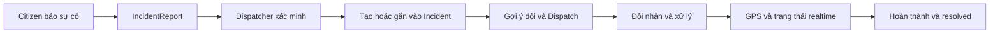
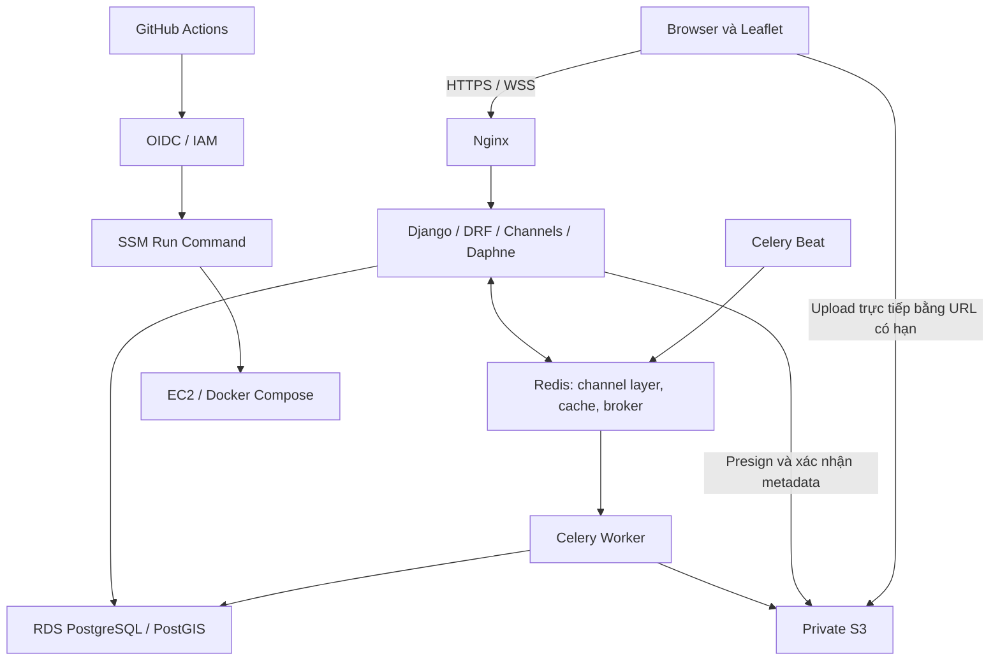

# Hệ thống quản lý và điều phối ứng phó sự cố khẩn cấp theo thời gian thực

**Real-time Emergency Response Management and Dispatch System**

**Production / Live demo:** [https://vjettejv.id.vn](https://vjettejv.id.vn)

Ứng dụng Web GIS kết nối người dân, điều phối viên và đội ứng cứu. Người dân gửi báo cáo kèm vị trí, thông tin liên hệ và media hiện trường; điều phối viên xác minh, liên kết các báo cáo liên quan thành sự cố và phân công đội phù hợp.

GeoDjango/PostGIS hỗ trợ truy vấn theo khoảng cách; WebSocket cập nhật trạng thái sự cố, nhiệm vụ và vị trí đội trên bản đồ. Đây là sản phẩm đồ án, không phải dịch vụ tiếp nhận khẩn cấp chính thức 112/114/115.

## Chức năng chính

| Vai trò | Chức năng |
| --- | --- |
| **Citizen** | Gửi báo cáo; lấy GPS; chọn/chỉnh vị trí hiện trường trên Leaflet; tìm địa chỉ và reverse geocoding; chụp ảnh/quay video; gửi thông tin liên hệ; theo dõi báo cáo của mình. |
| **Dispatcher** | Tiếp nhận và xác minh báo cáo; quản lý bản đồ sự cố/báo cáo/đội; lọc và tìm kiếm; xem đề xuất báo cáo liên quan; link/merge hoặc bỏ qua đề xuất; gợi ý đội theo khả năng, độ sẵn sàng và khoảng cách; phân công/đổi/hủy nhiệm vụ; theo dõi GPS, trạng thái và timeline; liên hệ người báo tin theo quyền. |
| **Rescue Team** | Xem nhiệm vụ và vị trí hiện trường; nhận nhiệm vụ; cập nhật tiến độ; chia sẻ GPS; gọi người báo tin khi có sự đồng ý và nhiệm vụ còn hoạt động. |
| **Admin** | Quản lý người dùng/vai trò, loại sự cố và đội ứng cứu; tìm kiếm/lọc; vô hiệu hóa tài khoản; xem cấu hình nghiệp vụ hiện tại (chỉ đọc). |

Tiến trình nhiệm vụ qua API: `assigned → accepted → en_route → on_scene → responding → completed`. Trạng thái `assigned` được lưu nội bộ dưới tên `pending`.

Giao diện responsive dùng cùng API thật cho cả bốn vai trò. Khi mất kết nối, dữ liệu giữ lại được đánh dấu **Dữ liệu gần nhất**; sau reconnect, ứng dụng đồng bộ REST trước khi tiếp tục hiển thị cập nhật realtime.

## Quy trình nghiệp vụ



Báo cáo tiềm năng trùng được tìm bằng loại sự cố, trạng thái, khoảng cách và khoảng thời gian cấu hình. Dispatcher quyết định liên kết/gom báo cáo; hệ thống không tự merge. Gợi ý đội dùng truy vấn không gian trên PostGIS, không quét toàn bộ dữ liệu bằng Python.

## Công nghệ

| Thành phần | Stack trong repository |
| --- | --- |
| Backend | Python 3.12 trong Docker; Django 5.2; Django REST Framework; GeoDjango |
| Database | PostgreSQL/PostGIS; local dùng image `postgis/postgis:16-3.4`, production dùng AWS RDS |
| Realtime | Django Channels, Daphne, Redis Channel Layer, WebSocket |
| Tác vụ nền | Celery Worker + một Celery Beat; Redis broker; dọn media hết hạn/xóa media với retry giới hạn |
| Frontend | Vanilla HTML/CSS/JavaScript, Leaflet 1.9.4, OpenStreetMap; không có npm build |
| Địa chỉ | Adapter Nominatim qua backend, cache và giới hạn tần suất; provider cấu hình được |
| Media | Amazon S3 private, boto3, presigned upload/download |
| Triển khai | AWS EC2, Docker Compose, Nginx, HTTPS/WSS; override CloudWatch tùy chọn |
| CI/CD | GitHub Actions, AWS OIDC/IAM, AWS Systems Manager Run Command |

Các phiên bản Python dependency được pin trong [backend/requirements.txt](backend/requirements.txt). Chưa có tính tuyến đường/ETA, nén ảnh hoặc gửi notification; Celery hiện phục vụ vòng đời media.

## Kiến trúc



Business logic nằm trong các service và transaction của backend. Thay đổi trạng thái/liên kết được ghi lịch sử; sự kiện realtime chỉ phát sau commit. WebSocket truyền sự kiện, còn CRUD, điều phối và cập nhật GPS dùng REST.

## Cấu trúc repository

```text
.
├── backend/
│   ├── config/             # Settings, ASGI, Celery, test runner
│   ├── accounts/           # Authentication, users, roles, seed_demo
│   ├── incidents/          # Reports, incidents, clustering, contacts, geocoding
│   ├── teams/              # Response teams và vị trí GPS
│   ├── dispatch/           # Assignment, suggestions, timeline, history
│   ├── evidence/           # Media lifecycle, S3 adapter, cleanup tasks
│   ├── operations/         # REST quản trị
│   ├── common/             # Health, pagination, logging, shared utilities
│   ├── realtime/
│   │   └── frontend/       # index.html, app.js, client.js, map.js, style.css
│   ├── tests/              # Backend integration và frontend Node tests
│   ├── manage.py
│   └── requirements.txt
├── infra/                  # Dockerfile, Nginx, CI/deploy scripts, IAM templates
│   └── tests/              # Kiểm tra deployment và repository safety
├── .github/workflows/      # CI/CD và chẩn đoán OIDC thủ công
├── compose.yaml            # Local PostGIS, Redis, backend, worker, beat
├── compose.production.yaml # Production override, initialize, Nginx, RDS
├── compose.https.yaml      # HTTPS override
├── compose.cloudwatch.yaml # CloudWatch logging override tùy chọn
├── .env.example
└── .env.production.example
```

Migrations nằm trong từng module Django; không bỏ migrations khỏi version control. Tài liệu đồ án, ghi chú nội bộ và artifact kiểm tra không nằm trong source được push.

## Chạy local

Yêu cầu Docker với Compose; Compose **2.24.4 trở lên** nếu dùng các production override. Node.js 24 dùng để chạy test frontend, không cần để phục vụ giao diện.

Từ thư mục repository, tạo `.env` từ `.env.example` (PowerShell: `Copy-Item .env.example .env`; Linux/macOS: `cp .env.example .env`). Thay hai placeholder `DJANGO_SECRET_KEY` và `POSTGRES_PASSWORD` bằng giá trị local riêng, không commit `.env`.

```bash
docker compose build backend worker beat
docker compose up -d db redis
docker compose run --rm backend python manage.py migrate
docker compose run --rm backend python manage.py seed_categories
docker compose up -d backend worker beat
```

Mở [http://localhost:8000/realtime/](http://localhost:8000/realtime/). API readiness: [http://localhost:8000/api/health/](http://localhost:8000/api/health/).

Tạo tài khoản quản trị local khi cần:

```bash
docker compose exec backend python manage.py createsuperuser
```

### Tài khoản seed để thử nghiệm local

`seed_demo` tạo các username **`demo_citizen`**, **`demo_dispatcher`**, **`demo_rescue_team`**, **`demo_admin`** và một đội giả lập. Mật khẩu lấy từ biến môi trường tạm `DEMO_PASSWORD`; không có mật khẩu mặc định trong repository, không công bố thông tin đăng nhập production. Có thể đăng ký Citizen qua giao diện.

Trên PowerShell, nhập mật khẩu seed mà không ghi giá trị vào lịch sử lệnh:

```powershell
$env:DEMO_PASSWORD = [System.Net.NetworkCredential]::new('', (Read-Host 'Mật khẩu seed local' -AsSecureString)).Password
try {
    docker compose exec -e DEMO_PASSWORD backend python manage.py seed_demo
} finally {
    Remove-Item Env:DEMO_PASSWORD
}
```

Lệnh giữ nguyên tài khoản, mật khẩu và dữ liệu đã tồn tại. Không chạy seed demo trên production. Khi gửi báo cáo thử, nhập họ tên và số điện thoại thử nghiệm; seed không tự cung cấp thông tin liên hệ cho Citizen.

S3 cần bucket private và quyền truy cập hợp lệ để thử upload thật. Nếu chưa cấu hình, luồng media không hoạt động; không có storage giả thay thế. Camera/GPS cần quyền trình duyệt và secure context (localhost hoặc HTTPS).

## Biến môi trường

Danh sách đầy đủ và giá trị mẫu nằm trong [.env.example](.env.example) và [.env.production.example](.env.production.example).

| Nhóm | Biến chính |
| --- | --- |
| Django | `DJANGO_SECRET_KEY`, `DJANGO_ENV`, `DJANGO_DEBUG`, `DJANGO_ALLOWED_HOSTS`, `DJANGO_HTTPS_ENABLED`, `CSRF_TRUSTED_ORIGINS`, `CORS_ALLOWED_ORIGINS` |
| Database | `POSTGRES_HOST`, `POSTGRES_PORT`, `POSTGRES_DB`, `POSTGRES_USER`, `POSTGRES_PASSWORD`, `POSTGRES_SSLMODE`, `POSTGRES_SSLROOTCERT`; `POSTGRES_HOST_PORT` chỉ cho cổng local |
| Redis / Celery | `REDIS_URL`, `REDIS_CACHE_URL`, `REDIS_CHANNEL_PREFIX`, `CELERY_BROKER_URL`, `CELERY_TASK_DEFAULT_QUEUE` |
| Realtime / GPS | `WS_ALLOWED_ORIGINS`, `GPS_MIN_INTERVAL_SECONDS`, `GPS_MAX_AGE_SECONDS`, `GPS_FUTURE_TOLERANCE_SECONDS` |
| Không gian | `CLUSTER_RADIUS_METERS`, `CLUSTER_TIME_WINDOW_MINUTES`, `CLUSTER_MAX_CANDIDATES`, `DISPATCH_RADIUS_METERS`, `DISPATCH_MAX_SUGGESTIONS` |
| Bản đồ / camera | `LEAFLET_TILE_URL`, `GEOCODER_BASE_URL`, `GEOCODER_USER_AGENT`, `GEOCODER_CACHE_SECONDS`, `INCIDENT_LOCATION_DISTANCE_WARNING_METERS`, `CAMERA_VIDEO_MAX_SECONDS` |
| S3 / media | `AWS_REGION`, `S3_BUCKET_NAME`, `AWS_EC2_METADATA_DISABLED`, `MEDIA_MAX_BYTES`, `MEDIA_UPLOAD_TTL_SECONDS`, `MEDIA_DOWNLOAD_TTL_SECONDS`, `MEDIA_CLEANUP_GRACE_SECONDS` |
| Production Compose | `COMPOSE_PROJECT_NAME`, `APP_IMAGE`, `APP_TAG`, `PUBLIC_HOST`, `HTTP_PORT`, `HTTPS_PORT`; `CLOUDWATCH_LOG_GROUP` khi bật override logging |

EC2 dùng IAM instance role; không cần access key trong app. Khi chạy local, boto3 có thể lấy credentials từ môi trường theo `.env.example`. Upload trực tiếp cần CORS S3 cho đúng origin; URL upload/download có thời hạn, giới hạn bởi cấu hình.

## API và realtime

REST base: `/api/v1/`. Xác thực dùng DRF Token trong header `Authorization: Token <token>`. Backend kiểm tra role/ownership cho từng thao tác; đăng ký luôn tạo Citizen.

| Nhóm | Endpoint chính |
| --- | --- |
| Authentication | `auth/register/`, `auth/login/`, `auth/logout/`, `auth/me/` |
| Báo cáo / loại sự cố | `incident-reports/`, `incident-reports/drafts/`, `incident-categories/` |
| Sự cố | `incidents/`; các action xác minh/link/merge/trạng thái nằm trong `incidents/views.py` |
| Điều phối | `incidents/<id>/suggested-teams/`, `incidents/<id>/assignments/`, `assignments/` |
| GPS | `teams/me/location/`, `teams/locations/` |
| Media | `media/presign/`, `media/`, `media/<uuid>/confirm/`, `media/<uuid>/download/`, `media/<uuid>/` |
| Địa chỉ | `geocoding/search/`, `geocoding/reverse/` (POST, Citizen) |
| Admin | `admin/users/`, `admin/categories/`, `admin/teams/`, `admin/configuration/` |

Frontend dùng routes `/realtime/#/citizen/report`, `/realtime/#/dispatcher`, `/realtime/#/rescue`, `/realtime/#/admin/users`; login tại `/realtime/#/login` và redirect theo role.

WebSocket routes: **`/ws/dispatcher/`**, **`/ws/rescue/`**. Client gửi token trong frame xác thực đầu tiên; server chọn group theo quyền. Các event nghiệp vụ gồm `incident.status_changed`, `assignment.status_changed`, `team.location_updated`, `report.changed`, `reports.linked`; client reconnect và đồng bộ REST khi kết nối lại.

Media đi theo luồng **metadata → presigned URL → upload trực tiếp S3 → confirm → metadata database**. Backend xác nhận object/metadata/checksum trước khi cấp quyền tải. Repository chưa có Swagger/OpenAPI UI.

## Production và CI/CD

Production hiện tại: [https://vjettejv.id.vn](https://vjettejv.id.vn), chạy trên EC2 bằng Docker Compose, Nginx, Django/Daphne, Redis, Celery, RDS PostgreSQL/PostGIS và S3. Database production dùng TLS `verify-full`; chỉ Nginx publish cổng ra ngoài.

Workflow [.github/workflows/ci-cd.yaml](.github/workflows/ci-cd.yaml) chạy khi push hoặc pull request vào `main`:

1. CI scan source/lịch sử Git, kiểm tra scripts hạ tầng, validate Compose, build Docker, Django check, migrate, kiểm tra thiếu migration, test backend và frontend.
2. Chỉ push `main` vượt qua CI mới chạy CD. GitHub nhận credentials tạm qua OIDC, gọi SSM và triển khai đúng commit đã test trên EC2.
3. Deployment build image, chạy migrations/collectstatic qua `initialize`, khởi động services và kiểm tra container/HTTPS readiness. Health check lỗi làm workflow fail; cơ chế khôi phục image không đảo ngược schema.

GitHub repository **Variables** đang được workflow sử dụng: `AWS_REGION`, `AWS_ROLE_ARN`, `EC2_INSTANCE_ID`, `DEPLOY_PATH`. Không cần SSH deployment key hoặc AWS access key dài hạn cho flow này. Environment production và chứng chỉ được giữ trên EC2, ngoài Git.

## Kiểm tra

```bash
docker compose config --quiet
docker compose run --rm backend python manage.py check
docker compose run --rm backend python manage.py makemigrations --check --dry-run
docker compose run --rm backend python manage.py test tests --noinput
node --test backend/tests/frontend_realtime.test.cjs
python -m unittest discover -s infra/tests
python infra/check_repository.py --history
```

PostGIS và Redis phải đang chạy cho backend integration tests; test runner cô lập dữ liệu Redis. S3 được kiểm tra bằng botocore Stubber; worker tests dùng queue riêng. Các test kiểm tra phân quyền, chuyển trạng thái, truy vấn không gian, concurrency, media, lỗi dịch vụ và reconnect/UI. Một số test deployment chỉ chạy trên Linux.

`infra/ci.sh` chạy toàn bộ pipeline trên checkout sạch, tự tạo môi trường test và yêu cầu `COMPOSE_PROJECT_NAME` dạng `ers-ci-*`; không chạy script này trên thư mục đang chứa `.env` phát triển. Frontend không có bước build riêng.

## Bảo mật và phạm vi

- Secrets được lấy từ environment/IAM; không lưu mật khẩu, token hoặc khóa riêng trong Git.
- Role/ownership được backend xác thực; frontend guard chỉ hỗ trợ điều hướng.
- Contact được che ở danh sách; truy cập chi tiết và gọi điện phụ thuộc quyền, consent và nhiệm vụ.
- S3 private, key do server tạo; file type/kích thước/checksum được kiểm tra, URL có hạn.
- Production dùng HTTPS/WSS; WebSocket kiểm tra token, origin và nhóm được phép.
- OIDC thay credentials AWS dài hạn trong CI/CD; logging tránh in token, signed URL và dữ liệu liên hệ.

Repository phục vụ đồ án và demo nghiệp vụ. Chưa bao gồm kiểm thử tải cuối cùng, notification, định tuyến/ETA hay cam kết khả dụng của một dịch vụ khẩn cấp thực tế.
